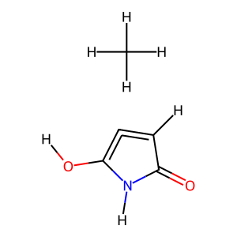
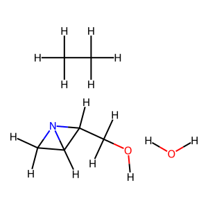
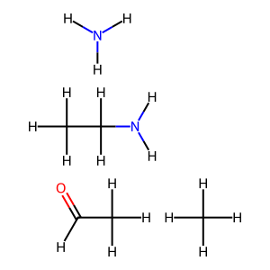
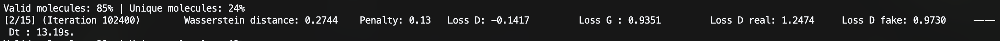

# MolGAN

A PyTorch implementation of the MolGAN (Molecular Generative Adversarial Network) using Wasserstein GAN with gradient penalty (WGAN-GP) for generating valid molecular structures. The paper uses RL to optimize for certain chemical properties, but this implementation does without RL by monitoring validity and novelty algorithmically.

## Generated Molecules

<p align="center">
  
  
  
</p>

## Overview

This project trains a generative model to create novel, chemically valid molecules represented as graphs. The generator produces adjacency matrices (bonds) and node features (atoms), while a graph convolutional discriminator evaluates their realism.

## Architecture

- **Generator**: Multi-layer perceptron with Gumbel-Softmax for discrete graph generation
- **Discriminator**: Relational Graph Convolutional Network (R-GCN) with graph pooling
- **Training**: WGAN-GP with gradient penalty for (relatively) stable adversarial learning
- **Dataset**: QM9 molecular dataset (filtered to C, O, N, F atoms, up to 9 heavy atoms)

## Installation

```bash
pip install -r requirements.txt
```

## Training

Run the training script:

```bash
python train.py
```

This will:
- Download and prepare the QM9 dataset
- Train the generator and discriminator for 15 epochs
- Save the best (for % validity) generator checkpoint as `generator_<validity>.pt`

### Example Training Progress

<p align="center">
  
</p>

## Sampling Molecules

Generate novel molecules using the trained model (you can use the provided `generator.pt` or train your own.)

```bash
python sample_molecules.py
```

This will:
- Load the trained generator from `generator.pt`
- Generate 20 novel molecules (not in training set)
- Save images to `sampled_molecules/`
- Ensure all molecules are valid, unique, and novel

## Model Configuration

Key hyperparameters:
- `N = 9`: Maximum number of heavy atoms (utils.py)
- `T = 5`: Number of atom types (C, O, N, F, padding) (utils.py)
- `Y = 4`: Number of bond types (no bond, single, double, triple) (utils.py)
- `NZ = 32`: Latent noise dimension (utils.py)
- `BATCH_SIZE = 128`: Training batch size (train.py)
- `LAMBDA = 10`: Gradient penalty coefficient (train.py)
- `EPOCHS = 15`: Number of training epochs (train.py)
- `LR_G = 0.001`: Generator learning rate (train.py)
- `LR_D = 0.001`: Discriminator learning rate (train.py)

## Original Paper

Based on:
- De Cao, N., & Kipf, T. (2018). MolGAN: An implicit generative model for small molecular graphs.
